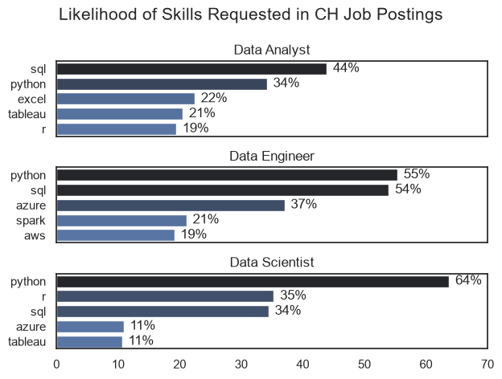
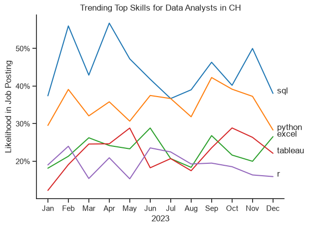
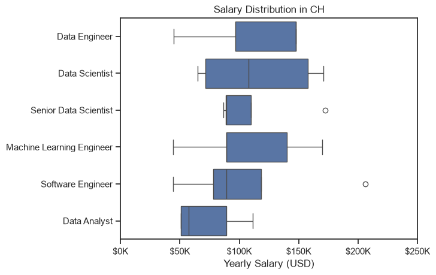
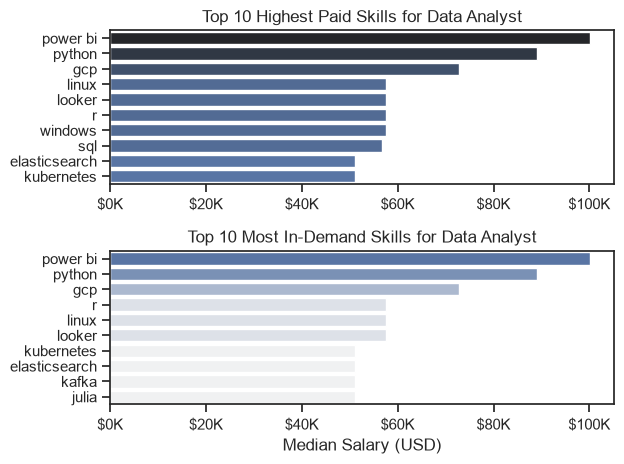

# The Analysis

## 1. What are the most demanded skills for the top 3 most popular data roles?

To find the most demanded skills, I filtered out the most popular positions and got the top skills for these roles. This highlights the popular job titles and their skills and shows which skills you should pay attention to depending on the role.

Notebook with detailed steps: [02_skill_demand.ipynb](02_skill_demand.ipynb)

### Results

  
*Bar graph visualizing the likelihood of skills requested in job postings in CH in 2023*

### Insights

- Python is a versatile skill and highly demanded across all three roles, but most prominently for Data Scientist (64%) and Data Engineer (55%).
- SQL is the most requested skill for Data Analysts (44%) and Data Engineers (54%), with it in over half the job postings for Data Engineers.
- Data Engineers require more specialized technical skills (AWS, Spark) compared to Data Analysts and Data Scientists, who are expected to have skills in more general data management and analysis tools (Excel, Tableau).

## 2. How are in-demand skills trending for Data Analysts?

Notebook with detailed steps: [03_skill_trend](03_skills_trend.ipynb)

### Results
  
*Line graph visualizing the trending top skills for data analysts in CH in 2023.*

### Insights
- SQL is the most demanded skill throughout the year next to Python, although they both show a decrease in demand.
- Excel experienced an increase in demand at the end of the year and surpassing Tableau.
- Tableau and R show relatively stable demand throughout the year with some fluctuations. They remain important skills for data analysts.

## 3. How well do jobs and skills pay for Data Analysts?

Notebook with detailed steps: [04_salary_analysis](04_salary_analysis.ipynb)

### Highest paid roles

#### Results
  
*Box plot visualizing the salary distributions for the top 6 data job titles.*

#### Insights
- The salaries variate significantly across the different job titles. Data Scientist has is a top-paying role even though it is the widest spread.
- Most of Data Analysts earn less than the other roles.
- Counterintuitive is that the box of Senior Data Scientists is lower and narrower than the box of the regular Data Scientists. The Senior role has also an outlier at $170K but that is close to the top-quartile of non-senior Data Scientists. This could reflect a too small sample size, inconsistent  title inflation or data quality issues.
- The outlier of the role Software Engineer at $205K is the highest individual salary across the roles even though the median is mid-to-low. This likely represents a senior-level or specialized engineer.
- Only the roles Senior Data Scientists and Software Engineers have outliers, where as the other roles are more consistent.
- In general roles with Engineer or Scientist have a higher pay than roles with Analyst.

### Highest paid & most demanded skills for Data Analysts

#### Results
  
*Two bar graphs visualizing the highest paid skills and most in-demand skills for Data Analysts in CH.*

#### Insights
- Power BI, Python and GCP are both the highest paid and most in-demand skills. These three skills stand out and then with a gap the other skills follow in a flat tail.
- SQL appears in the top 10 highest paid skills but not in the top 10 most in-demand skills, which is counterintuitive, since SQL is often used.
- It is unusual that so many infrastructure skills are listed among the most in-demand skills for Data Analysts.